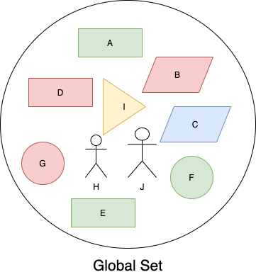

# Markus Documentation

Markus provides a statically-typed way for developers to express the abstract logic and
functionality of a certain piece of software without going into implementation details.

## Table of contents

1. [Background & Types](#background-&-types)
2. [Queries](#queries)
3. [Atomic Types](#atomic-types)
4. [User Type](#user-type)
5. [Permissions & Guards](#permissions-&-guards)

## Background & Types

<div style="text-align:center"></div>

In Markus anything is an _Object_ and there is no concept like _Table_ (as in SQL databases)
that separates them from one another, anything that is present in the database is a member of
`Global Set`.

Markus Object Model supports Multiple Inheritance, meaning that any object-type can inherit
properties from more than one object-types, as an example in the picture above you can see
there are some `Rectangles` and a `Triangle` and we know that both of them can be categorized
as `Polygon`.

In markus we use the following syntax to define a type:

```markus
# type TypeName [: BASE* ] {
#  [property_name[?]: Type;]*
# }

type Polygon {}
type Triangle: Polygon {}

type Carnivorous {}
type Mammal {}

# The cat is a small carnivorous mammal.
type Cat: Carnivorous, Mammal {
  # Let's give our kitty a name.
  name: string;
}
```

You can also look at the source code that shapes the picture above to understand more.

<details>
<summary>Click to see source code</summary>

```markus
type Named {
  name: string;
}

type Colored {
  color: string;
}

# `Shape` is `Named` and `Colored`.
type Shape: Named, Colored {}

# We define `Circle` as a shape.
type Circle: Shape {}

type Polygon: Shape {}

type Triangle: Polygon {}

type Quadrilateral: Polygon {}

type Parallelogram: Polygon {}

type Rectangle: Parallelogram {}

type Person: Named {
  height: number;
}

# Data:
# Rectangle(name: "A", color: "green")
# Parallelogram(name: "B", color: "red")
# Parallelogram(name: "C", color: "blue")
# Rectangle(name: "D", color: "red")
# Rectangle(name: "E", color: "green")
# Circle(name: "F", color: "green")
# Circle(name: "G", color: "red")
# Person(name: "H", height: 160)
# Triangle(name: "I", color: "yellow")
# Person(name: "J", height: 185)
```

</details>

Looking at things in this way gives us the ability to write some powerful queries, let's
look at them in the next section.

## Queries

Now that we know how to start defining **things** in Markus using `types`, it's time to learn about
querying our database.

Let's start with the most basic query -an empty query-:

```markus
query MyQuery {}
```

<details>
<summary>Click to see the result</summary>

```ruby
Rectangle(name: "A", color: "green")
Parallelogram(name: "B", color: "red")
Parallelogram(name: "C", color: "blue")
Rectangle(name: "D", color: "red")
Rectangle(name: "E", color: "green")
Circle(name: "F", color: "green")
Circle(name: "G", color: "red")
Person(name: "H", height: 160)
Triangle(name: "I", color: "yellow")
Person(name: "J", height: 185)
```

</details>

As you can already guess the empty query will return all of the things in the database!
